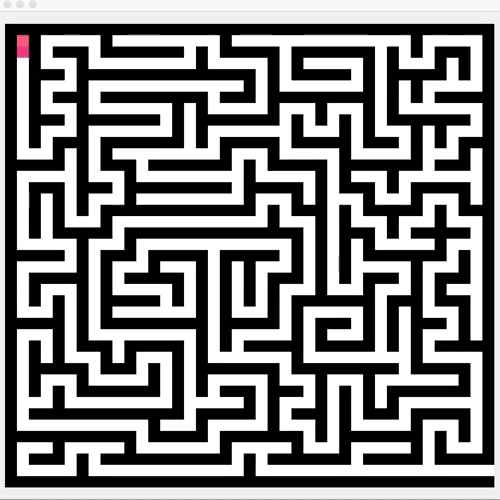

# MazeSearch
A Java program that uses a recursive algorithm to traverse and solve a randomly generated maze
## Generation
An algorithm randomly open up cells in a checkered array of 1s and 0s to create a basis for the maze.
## Solving
The program attempts different routes, backtracking when it hits a dead end, while using a stack to keep track of its current path. It continues to recursively traverse the maze until it has reached the exit. Upon completion, the program wipes the old maze and generates a new one.
## Demonstration

